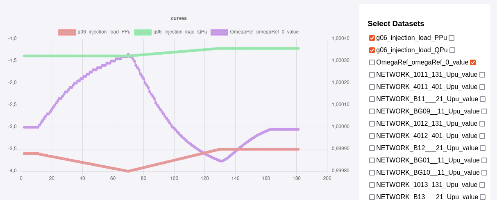

# Generator input scenario

Nordic test system is modified by disconnecting generator g06 from the network, and adding an injection **g06_injection** as an
interface for an external generator model.

The injection is represented by a modelica LoadPQ model.

P and Q values of the injection are connected to handler models (lib = DYNUpdatableContinuous). These values can be modified by sending to ZMQ server respectively:

**g06_injection_PRefPu,input_value,double,{P VALUE}**

and

**g06_injection_PRefPu,input_value,double,{Q VALUE}**

where {P VALUE} and {Q VALUE} are the **negated** values of the injection(due to load convention), **in base 100**. For an example, setting the output power of a generator to 400 MW would be reprensented by:

g06_injection_PRefPu,input_value,double,-4

## Example scenario

Python script **scenario_generator_input.py** can be used to run a simple scenario. To run it, launch the simulator in interactive mode, then run the python script.

Following table gives the actions sequence in the scenario:

| t | t+1 | Description|
|---|:----:|---|
| 0 | 10 | Constant P, Q (P0 = 360 MW, Q0 = -138 MVAr) |
| 11 | 70 | P ramp up to 400 MW, Q constant |
| 71 | 130 | P ramp down to 350 MW, P/Q constant |
| 131 | 180| Constant P, Q |

